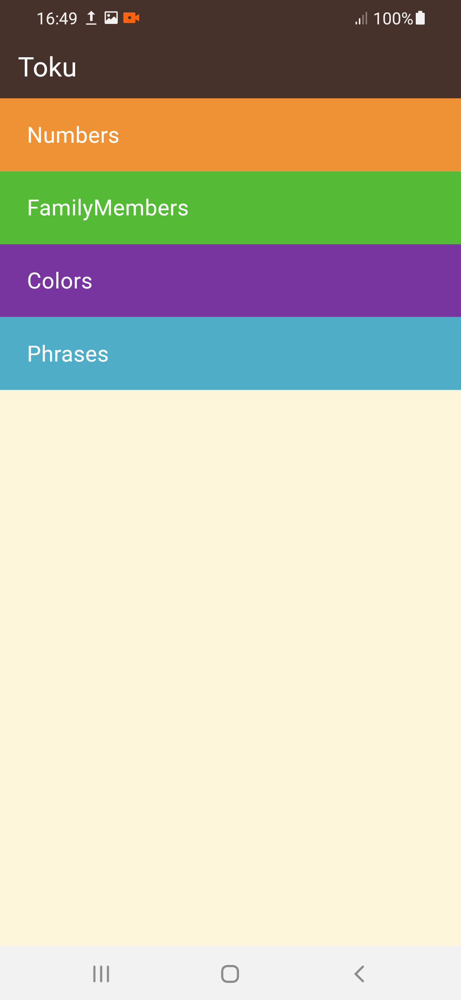
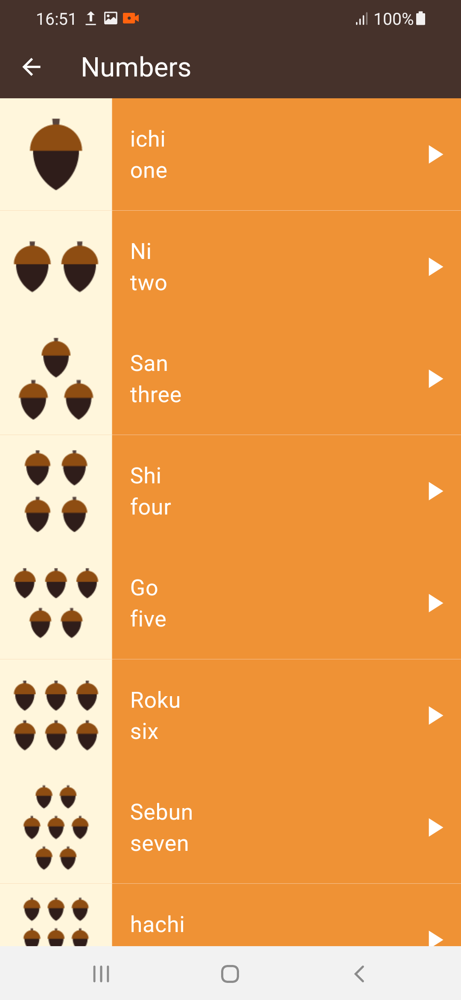

# learning_app

A new Flutter project for learning japanese.


# Flutter Japanese Learning App

This Flutter application is designed to help users learn Japanese vocabulary by providing audio pronunciation for words in both English and Japanese.

## Features

- **Bilingual Selection:** Users can select words displayed in both English and Japanese.
- **Audio Pronunciation:** Hear how each word is pronounced in Japanese.
- **Interactive Learning:** Engage with a simple and intuitive interface.
### App Pages

<div style="display: flex; flex-direction: row;">
  
  
   
   
   
</div>
## Technologies Used

- Flutter SDK
- Dart programming language
- Audioplayers package for audio management

## Getting Started

### Prerequisites

- Ensure you have Flutter installed on your development environment.
<br><br>

This project is a starting point for a Flutter application.

A few resources to get you started if this is your first Flutter project:

- [Lab: Write your first Flutter app](https://docs.flutter.dev/get-started/codelab)
- [Cookbook: Useful Flutter samples](https://docs.flutter.dev/cookbook)

For help getting started with Flutter development, view the
[online documentation](https://docs.flutter.dev/), which offers tutorials,
samples, guidance on mobile development, and a full API reference.

### Installation

1. Clone the repository:

   ```bash
   git clone https://github.com/your-username/your-repository.git
   cd your-repository
